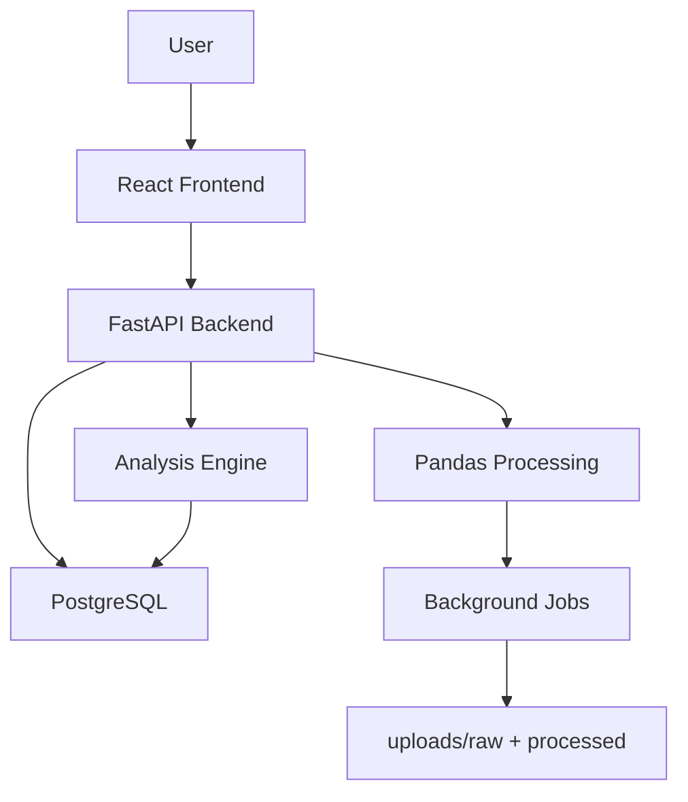
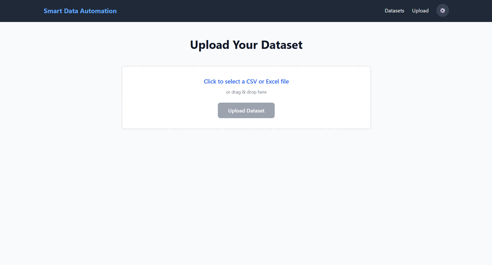
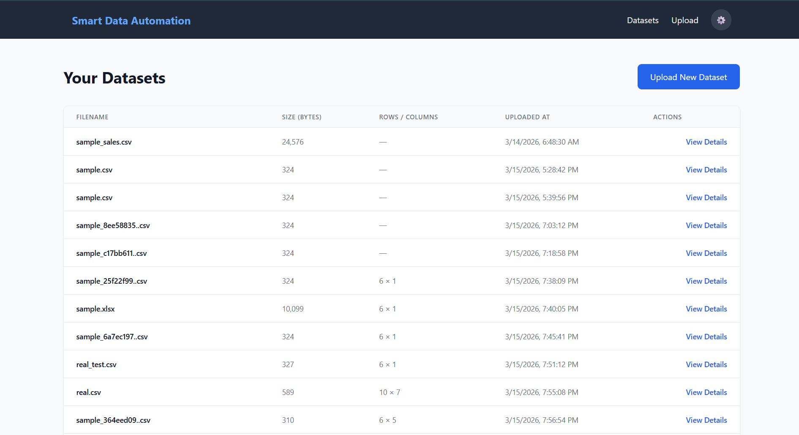
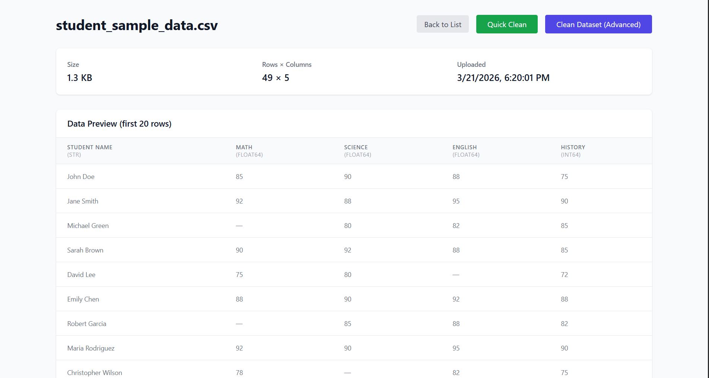
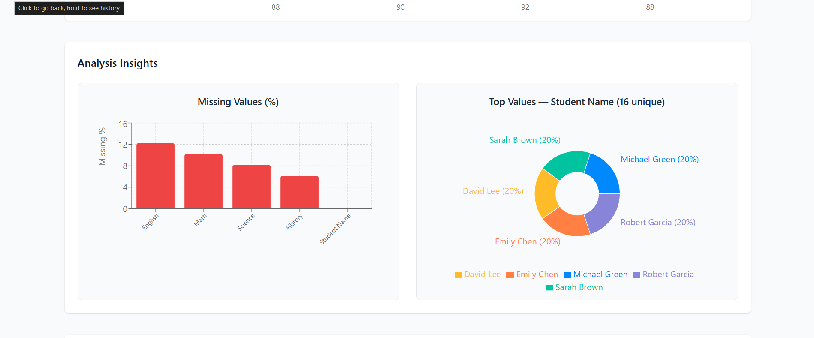
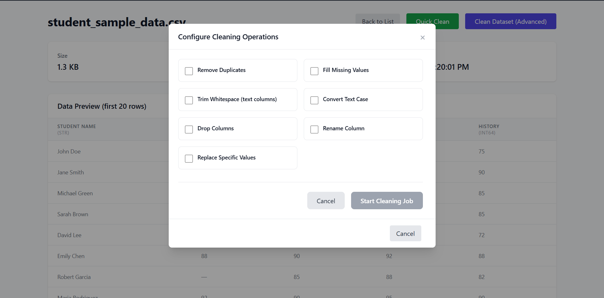
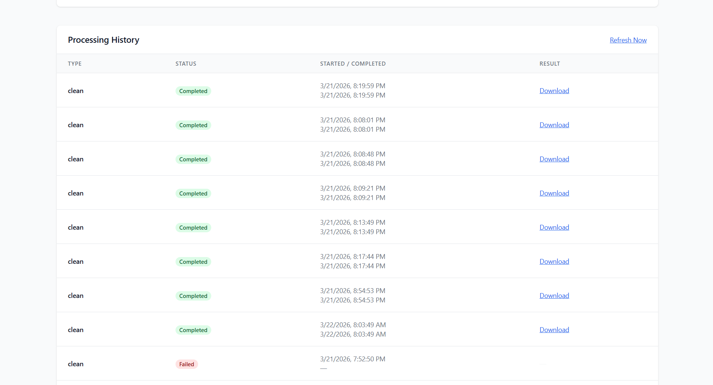

# Smart Data Automation Platform


A lightweight, user-friendly web application for automatic dataset analysis, cleaning, and transformation. Built as a self-service data preparation tool with
background job processing and interactive visualizations.

---

## ✨ Features

### Backend
- **File Upload**: Support for CSV and Excel files with metadata storage
- **Automatic Analysis**: Missing values, duplicates, data types, numeric statistics, categorical top values — stored as JSONB
- **Background Cleaning Pipeline**: Multiple operations including:
  - Remove duplicates
  - Fill missing values (mean, median, constant, forward/backward fill)
  - Trim whitespace
  - Convert case (title, upper, lower)
  - Drop columns
  - Rename columns
  - Replace specific values
- **Job Tracking**: Full history with status (pending/running/completed/failed), timestamps, and error messages
- **File Versioning**: Cleaned files saved as `filename_cleaned_v1.csv`, `v2`, etc.
- **Export/Download**: Stream cleaned files with proper headers

### Frontend
- Modern React 19 + TypeScript + Tailwind CSS + Vite
- Responsive dataset list with key metrics
- Interactive **Dataset Detail** page featuring:
  - Data preview table
  - Rich analysis report with **Recharts visualizations** (missing % bar chart + categorical top values pie charts)
  - Live **Job History** table with auto-refresh polling
  - **Advanced Cleaning Modal** with configurable operations and column selection
- Dark mode support
- Toast notifications and loading skeletons

--- 

## 🏗️ System Architecture




---

## 🚀 Key Features

* **Automated Analysis:** Instant generation of data profiles stored as `JSONB` for lightning-fast retrieval.
* **Asynchronous Processing:** Data cleaning and heavy lifting handled via `FastAPI BackgroundTasks`.
* **Job System:** Live-updating job monitoring with status polling.
* **Data Versioning:** Automatic tracking of cleaned file versions (e.g., `_cleaned_vN.csv`).
* **Interactive UI:** Responsive dashboard featuring **Recharts** for data visualization.

---

## 🛠️ Tech Stack

### **Frontend**
* **Framework:** React 19 + TypeScript
* **Build Tool:** Vite
* **Styling:** Tailwind CSS
* **Charts:** Recharts
* **API Client:** Axios

### **Backend**
* **API Framework:** FastAPI
* **ORM:** SQLAlchemy + Alembic (Migrations)
* **Database:** PostgreSQL (utilizing `JSONB` for flexible reports)
* **Data Science:** Pandas + openpyxl

---

## 📊 System Flow

1.  **Upload:** File saved to `uploads/raw/` → Metadata persisted in PostgreSQL.
2.  **Auto-Analysis:** Background process triggers → Results stored in `analysis_report` JSONB field.
3.  **Visualization:** View interactive preview tables, detailed stats, and distribution charts.
4.  **Cleaning:** User selects operations (handling nulls, types, etc.) → Job is queued.
5.  **Monitoring:** Frontend polls the Job System for live progress updates.
6.  **Export:** Download the processed, version-controlled dataset.

---

## ⚙️ Getting Started

### Prerequisites
* **Python** 3.11+
* **Node.js** 18+
* **PostgreSQL** (Running instance)

### 1. Backend Setup
```bash
cd backend
python -m venv venv

# Activate Virtual Env
# Windows: venv\Scripts\activate | Unix: source venv/bin/activate
source venv/bin/activate

pip install -r requirements.txt

# Environment Configuration
cp .env.example .env
# Open .env and update your DATABASE_URL

# Run Migrations & Start Server
alembic upgrade head
uvicorn app.main:app --reload
```

### 2. Frontend Setup
```bash
cd frontend
npm install
npm run dev
```

---

## 📸 Screenshots

### 1. Upload Page


### 2.Dataset List


### 3. Dataset Detail – Preview & Analysis


### 3. Analysis Charts (Missing % + Top Values)


### 4. Advanced Cleaning Modal


### 5. Job History with Live Updates


---

## 🎯 What This Project Demonstrates

- Full-stack development using modern technologies
- Real data engineering workflows (ETL-like pipelines)
- Background processing and job tracking
- Dataset versioning
- Clean backend architecture
- routers
- services
- schemas
- models
- Responsive UI using TypeScript
- Real-world data cleaning workflows
- Live updates using polling
- Professional project structure and documentation

--- 
## 🐳 Docker Setup

The project is fully containerized using Docker and Docker Compose for easy local development and consistent environments.

### Quick Start with Docker

```bash
# From the project root
docker compose up --build
# Start all services in foreground
docker compose up --build

# Start in background (detached mode)
docker compose up -d --build

# Stop all services
docker compose down

# View logs
docker compose logs -f backend
docker compose logs -f frontend
```

### This will start:

- Frontend → http://localhost:5173
- Backend API → http://localhost:8000
- PostgreSQL → localhost:5433


---
## 🔮 Future Enhancements

### Planned improvements include:

- Natural Language → Data Cleaning Operations using Groq LLM
- AI-powered data quality suggestions
- User authentication and multi-user support
- Advanced dataset profiling and charts
- Celery + Redis for production-grade background jobs

---

⭐ If you like this project, consider giving it a star on GitHub!
